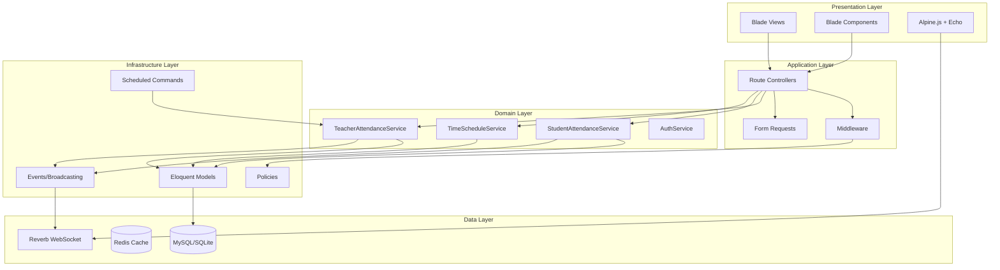
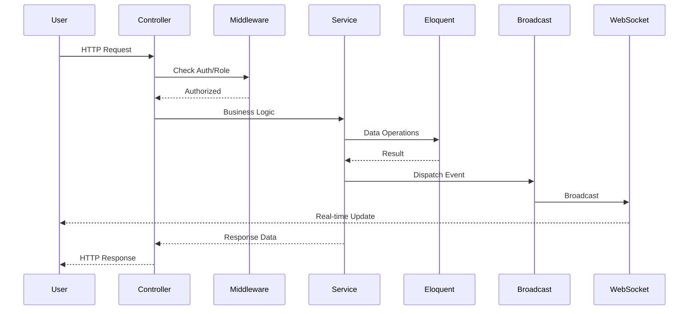
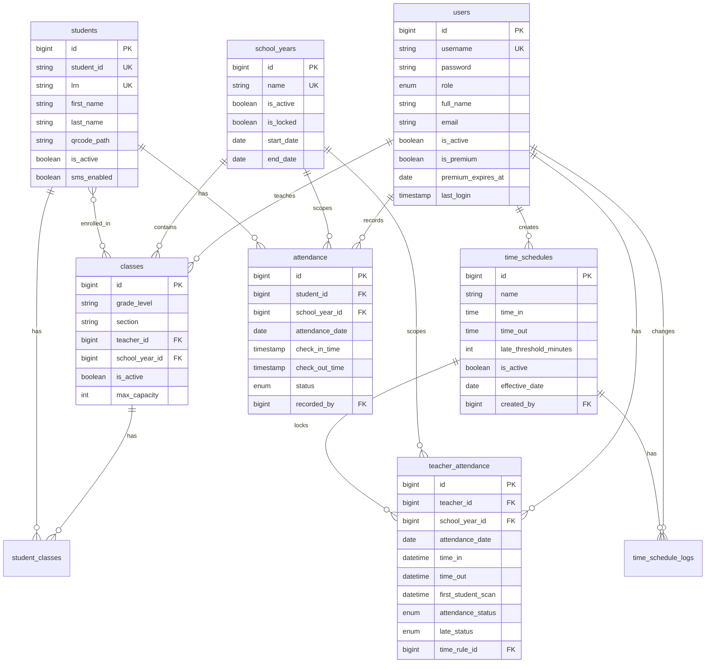

# Design Document

## Overview

This design document outlines the architecture and implementation approach for migrating the QR Attendance System to Laravel 11. The system follows a service-oriented architecture with thin controllers, Eloquent ORM for data access, and Laravel Reverb for real-time WebSocket communication. The design preserves all existing business logic, particularly the two-phase teacher attendance model and strict late determination rules.

### Key Design Principles

1. **Service Layer Pattern**: Business logic encapsulated in dedicated service classes
2. **Thin Controllers**: Controllers delegate to services, handling only HTTP concerns
3. **Eloquent Relationships**: Leverage Laravel's ORM for clean data access
4. **Event-Driven Updates**: WebSocket broadcasting for real-time UI updates
5. **Policy-Based Authorization**: Laravel policies for fine-grained access control

## Architecture



### Request Flow



## Components and Interfaces

### Service Classes

#### TeacherAttendanceService

```php
interface TeacherAttendanceServiceInterface
{
    public function recordTimeIn(int $teacherId, ?int $schoolYearId = null): bool;
    public function recordTimeOut(int $teacherId): bool;
    public function recordFirstStudentScan(int $teacherId, Carbon $scanTime): bool;
    public function finalizeAttendance(int $teacherId, string $date): void;
    public function markAbsentTeachers(?int $schoolYearId = null): int;
    public function markNoScanTeachers(): int;
    public function getAttendanceRecords(array $filters): Collection;
    public function getSummary(int $teacherId, ?int $schoolYearId): array;
}
```

#### StudentAttendanceService

```php
interface StudentAttendanceServiceInterface
{
    public function findStudentByQRCode(string $qrCode): ?Student;
    public function hasAttendanceToday(int $studentId): bool;
    public function recordAttendance(int $studentId, ?string $status = null): array|false;
    public function recordCheckout(int $studentId): bool;
    public function processQRCodeScan(string $qrCode, string $mode = 'arrival'): array;
    public function calculateLateStatus(string $checkTime): array;
    public function getAttendanceByDate(string $date, ?int $schoolYearId, ?int $classId, ?int $teacherId): Collection;
}
```

#### TimeScheduleService

```php
interface TimeScheduleServiceInterface
{
    public function getActive(): ?TimeSchedule;
    public function create(array $data, int $userId): TimeSchedule;
    public function update(int $id, array $data, int $userId, ?string $reason): bool;
    public function activate(int $id, int $userId): bool;
    public function delete(int $id, int $userId): bool;
    public function getChangeLogs(?int $scheduleId, int $limit): Collection;
}
```

#### IdCardService

```php
interface IdCardServiceInterface
{
    public function generateQRCode(Student $student): string;
    public function generateIdCard(Student $student): array;
    public function generateBatchIdCards(int $classId): Collection;
    public function exportToPdf(array $studentIds): string;
}
```

#### ReportService

```php
interface ReportServiceInterface
{
    public function getAttendanceReport(array $filters): Collection;
    public function calculateStatistics(Collection $records): array;
    public function getDailySummary(string $date, ?int $schoolYearId): Collection;
    public function exportToCsv(Collection $records): string;
    public function exportToPdf(Collection $records): string;
}
```

#### StudentPlacementService

```php
interface StudentPlacementServiceInterface
{
    public function transferStudent(int $studentId, int $fromClassId, int $toClassId, int $userId, ?string $reason): bool;
    public function placeStudent(int $studentId, int $classId, string $enrollmentType, int $userId): bool;
    public function bulkPlaceStudents(array $studentIds, int $classId, string $enrollmentType, int $userId): int;
    public function getPlacementHistory(int $studentId): Collection;
}
```

#### SubscriptionService

```php
interface SubscriptionServiceInterface
{
    public function getTeachersWithSubscriptions(): Collection;
    public function grantPremium(int $userId, Carbon $expiresAt): bool;
    public function revokePremium(int $userId): bool;
    public function isPremiumActive(User $user): bool;
}
```

#### SettingsService

```php
interface SettingsServiceInterface
{
    public function get(string $key, mixed $default = null): mixed;
    public function set(string $key, mixed $value, int $userId): bool;
    public function getAll(): array;
    public function getGroup(string $group): array;
}
```

### Middleware

#### CheckRole Middleware

```php
class CheckRole
{
    public function handle(Request $request, Closure $next, ...$roles): Response
    {
        // Admin bypasses all role checks
        // Principal inherits teacher access
        // Specific role matching for others
    }
}
```

### Event Broadcasting

#### StudentScanned Event

```php
class StudentScanned implements ShouldBroadcast
{
    public function __construct(
        public Student $student,
        public Attendance $attendance,
        public string $status
    ) {}
    
    public function broadcastOn(): array
    {
        return [
            new Channel('attendance.' . $this->attendance->school_year_id),
        ];
    }
}
```

#### TeacherAttendanceUpdated Event

```php
class TeacherAttendanceUpdated implements ShouldBroadcast
{
    public function __construct(
        public TeacherAttendance $attendance
    ) {}
    
    public function broadcastOn(): array
    {
        return [
            new Channel('teacher-monitoring.' . $this->attendance->school_year_id),
        ];
    }
}
```

## Data Models

### Entity Relationship Diagram



### Model Definitions

#### User Model

```php
class User extends Authenticatable
{
    protected $fillable = [
        'username', 'password', 'role', 'full_name', 
        'email', 'is_active', 'is_premium', 'premium_expires_at'
    ];
    
    protected $casts = [
        'is_active' => 'boolean',
        'is_premium' => 'boolean',
        'premium_expires_at' => 'date',
        'last_login' => 'datetime',
    ];
    
    // Relationships
    public function classes(): HasMany;
    public function teacherAttendances(): HasMany;
    public function createdSchedules(): HasMany;
    public function scheduleChanges(): HasMany;
    
    // Scopes
    public function scopeTeachers($query);
    public function scopeActive($query);
    
    // Helpers
    public function isAdmin(): bool;
    public function isPrincipal(): bool;
    public function isTeacher(): bool;
    public function hasRole(string $role): bool;
}
```

#### TeacherAttendance Model

```php
class TeacherAttendance extends Model
{
    protected $fillable = [
        'teacher_id', 'school_year_id', 'attendance_date',
        'time_in', 'time_out', 'first_student_scan',
        'attendance_status', 'late_status', 'time_rule_id', 'notes'
    ];
    
    protected $casts = [
        'attendance_date' => 'date',
        'time_in' => 'datetime',
        'time_out' => 'datetime',
        'first_student_scan' => 'datetime',
    ];
    
    // Relationships
    public function teacher(): BelongsTo;
    public function schoolYear(): BelongsTo;
    public function timeRule(): BelongsTo;
    
    // Scopes
    public function scopeToday($query);
    public function scopePending($query);
    public function scopeLate($query);
    public function scopeForSchoolYear($query, $id);
}
```

#### Attendance Model (Student)

```php
class Attendance extends Model
{
    protected $fillable = [
        'student_id', 'school_year_id', 'attendance_date',
        'check_in_time', 'check_out_time', 'status', 'recorded_by', 'notes'
    ];
    
    protected $casts = [
        'attendance_date' => 'date',
        'check_in_time' => 'datetime',
        'check_out_time' => 'datetime',
    ];
    
    // Relationships
    public function student(): BelongsTo;
    public function schoolYear(): BelongsTo;
    public function recorder(): BelongsTo;
    
    // Scopes
    public function scopeToday($query);
    public function scopeForSchoolYear($query, $id);
    public function scopeForClass($query, $classId);
}
```


## Correctness Properties

*A property is a characteristic or behavior that should hold true across all valid executions of a system-essentially, a formal statement about what the system should do. Properties serve as the bridge between human-readable specifications and machine-verifiable correctness guarantees.*

### Authentication Properties

**Property 1: Teacher login creates pending attendance**
*For any* teacher user, when they successfully log in, a teacher_attendance record SHALL exist for today with attendance_status = 'pending' and time_in set to a timestamp within 1 second of login time.
**Validates: Requirements 1.2, 3.1**

**Property 2: Teacher logout records time_out**
*For any* teacher user with an existing attendance record for today, when they log out, the time_out field SHALL be updated to a timestamp within 1 second of logout time.
**Validates: Requirements 1.3**

**Property 3: Invalid credentials maintain unauthenticated state**
*For any* invalid username/password combination, authentication SHALL fail and no session SHALL be created.
**Validates: Requirements 1.4**

### Role-Based Access Properties

**Property 4: Admin bypasses all role checks**
*For any* route protected by role middleware and any admin user, the admin SHALL be granted access regardless of the route's specified role requirements.
**Validates: Requirements 2.1**

**Property 5: Principal inherits teacher access**
*For any* route protected with 'teacher' role requirement and any principal user, the principal SHALL be granted access.
**Validates: Requirements 2.2**

**Property 6: Teacher denied admin routes**
*For any* route protected with 'admin' role requirement and any teacher user, the request SHALL return a 403 Forbidden response.
**Validates: Requirements 2.3**

**Property 7: Unauthenticated users redirected**
*For any* protected route and any unauthenticated request, the response SHALL be a redirect to the login page.
**Validates: Requirements 2.4**

### Teacher Attendance Phase 1 Properties

**Property 8: Multiple logins update existing record**
*For any* teacher who logs in multiple times on the same day, only one teacher_attendance record SHALL exist for that day, and time_in SHALL reflect the most recent login.
**Validates: Requirements 3.2**

**Property 9: Teacher attendance associates with active school year**
*For any* teacher_attendance record created during login, the school_year_id SHALL equal the currently active school year's ID.
**Validates: Requirements 3.3**

**Property 10: Login does not evaluate lateness**
*For any* teacher who has just logged in (before any student scan), the attendance_status SHALL be 'pending' and late_status SHALL be NULL.
**Validates: Requirements 3.4**

### Teacher Attendance Phase 2 Properties

**Property 11: First student scan records timestamp**
*For any* student scan where the student's teacher has a pending attendance record with NULL first_student_scan, the first_student_scan field SHALL be updated to the scan timestamp.
**Validates: Requirements 4.1**

**Property 12: First scan locks time_rule_id**
*For any* teacher_attendance record where first_student_scan is being set, the time_rule_id SHALL be set to the ID of the currently active TimeSchedule.
**Validates: Requirements 4.2**

**Property 13: First scan triggers finalization**
*For any* teacher_attendance record after first_student_scan is recorded, the attendance_status SHALL be either 'confirmed' or 'late' (not 'pending').
**Validates: Requirements 4.3**

**Property 14: Subsequent scans preserve first_student_scan**
*For any* student scan where the teacher's first_student_scan is already set, the first_student_scan timestamp SHALL remain unchanged.
**Validates: Requirements 4.4**

### Late Determination Properties

**Property 15: Late determination logic**
*For any* teacher_attendance record being finalized:
- IF teacher_time_in > cutoff_time OR first_student_scan > cutoff_time THEN attendance_status SHALL be 'late' AND late_status SHALL be 'late'
- IF teacher_time_in <= cutoff_time AND first_student_scan <= cutoff_time THEN attendance_status SHALL be 'confirmed' AND late_status SHALL be 'on_time'
Where cutoff_time = time_rule.time_in + time_rule.late_threshold_minutes
**Validates: Requirements 5.1, 5.2, 5.3**

**Property 16: Lateness uses locked time rule**
*For any* teacher_attendance finalization, the cutoff_time calculation SHALL use the TimeSchedule referenced by time_rule_id, not the currently active schedule.
**Validates: Requirements 5.4**

**Property 17: Historical records immutable on rule change**
*For any* TimeSchedule update, all existing teacher_attendance records with that time_rule_id SHALL retain their original attendance_status and late_status values.
**Validates: Requirements 5.5**

### Student Attendance Properties

**Property 18: Valid QR code creates attendance**
*For any* valid student QR code (matching LRN or student_id), scanning SHALL create an attendance record with check_in_time set to the current timestamp.
**Validates: Requirements 6.1**

**Property 19: QR code lookup priority**
*For any* QR code that matches both an LRN and a different student's student_id, the student with the matching LRN SHALL be returned.
**Validates: Requirements 6.2**

**Property 20: Duplicate scan prevention**
*For any* student who has already scanned today, a subsequent scan SHALL NOT create a new attendance record and SHALL return an appropriate error.
**Validates: Requirements 6.3**

**Property 21: Auto-calculate student late status**
*For any* student attendance record, if check_in_time > (active_schedule.time_in + active_schedule.late_threshold_minutes), status SHALL be 'late'; otherwise status SHALL be 'present'.
**Validates: Requirements 6.4**

**Property 22: Student scan triggers teacher Phase 2**
*For any* student scan where the student is enrolled in a class whose teacher has a pending attendance record with NULL first_student_scan, the teacher's first_student_scan SHALL be set.
**Validates: Requirements 6.5**

**Property 23: Invalid QR code creates no records**
*For any* QR code that does not match any student's LRN or student_id, no attendance record SHALL be created.
**Validates: Requirements 6.6**

### Time Schedule Properties

**Property 24: Time schedule creation logged**
*For any* TimeSchedule creation, a time_schedule_logs entry SHALL exist with action='create' and changed_by set to the creating user's ID.
**Validates: Requirements 7.1**

**Property 25: Time schedule update logged with values**
*For any* TimeSchedule update, a time_schedule_logs entry SHALL exist with action='update', old_values containing previous field values, and new_values containing updated field values.
**Validates: Requirements 7.2**

**Property 26: Single active time schedule invariant**
*For any* state of the system, at most one TimeSchedule SHALL have is_active = true.
**Validates: Requirements 7.3**

**Property 27: Active schedule deletion prevented**
*For any* TimeSchedule with is_active = true, a delete operation SHALL fail and the record SHALL remain in the database.
**Validates: Requirements 7.4**

### Student Management Properties

**Property 28: Student uniqueness constraints**
*For any* two students in the database, their student_id values SHALL be distinct AND their LRN values (if not null) SHALL be distinct.
**Validates: Requirements 8.1**

**Property 29: Role-based data visibility**
*For any* teacher querying students or classes, the result set SHALL contain only records associated with classes where teacher_id equals the querying user's ID.
**Validates: Requirements 8.2, 9.3**

**Property 30: Enrollment metadata recorded**
*For any* student_classes record, enrolled_at SHALL be set to the enrollment timestamp, enrolled_by SHALL reference the enrolling user, and enrollment_type SHALL be one of the valid enum values.
**Validates: Requirements 8.4**

**Property 31: Class capacity enforcement**
*For any* class where the count of active student_classes records equals max_capacity, additional enrollment attempts SHALL fail.
**Validates: Requirements 8.5**

### Class Management Properties

**Property 32: Class uniqueness constraint**
*For any* two classes in the database, the combination of (grade_level, section, school_year_id) SHALL be unique.
**Validates: Requirements 9.1**

**Property 33: Teacher role validation for class assignment**
*For any* class creation or update with a teacher_id, the referenced user SHALL have role = 'teacher'.
**Validates: Requirements 9.2**

**Property 34: Class deactivation preserves records**
*For any* class that is deactivated (is_active set to false), all associated attendance records SHALL remain in the database unchanged.
**Validates: Requirements 9.4**

### School Year Properties

**Property 35: Single active school year invariant**
*For any* state of the system, at most one SchoolYear SHALL have is_active = true.
**Validates: Requirements 10.1**

**Property 36: Locked school year prevents modifications**
*For any* SchoolYear with is_locked = true, attempts to create, update, or delete attendance records with that school_year_id SHALL fail.
**Validates: Requirements 10.2**

**Property 37: Attendance associates with active school year**
*For any* attendance record created through normal scanning flow, school_year_id SHALL equal the currently active school year's ID.
**Validates: Requirements 10.3**

### Teacher Monitoring Properties

**Property 38: Attendance statistics accuracy**
*For any* set of teacher_attendance records matching filter criteria, the statistics SHALL accurately reflect: count where attendance_status='confirmed', count where attendance_status='late', count where attendance_status='pending', count where attendance_status='absent'.
**Validates: Requirements 11.3**

### End-of-Day Processing Properties

**Property 39: Mark absent teachers creates correct records**
*For any* teacher without a teacher_attendance record for today when markAbsentTeachers() runs, a new record SHALL be created with attendance_status='absent'.
**Validates: Requirements 12.1, 12.3**

**Property 40: Mark no_scan updates pending records**
*For any* teacher_attendance record with attendance_status='pending' when markNoScanTeachers() runs, the attendance_status SHALL be updated to 'no_scan'.
**Validates: Requirements 12.2**

**Property 41: End-of-day scoped to active school year**
*For any* records created or updated by end-of-day processing, school_year_id SHALL equal the currently active school year's ID.
**Validates: Requirements 12.4**

### Event Broadcasting Properties

**Property 42: Student scan broadcasts event**
*For any* successful student attendance recording, a StudentScanned event SHALL be dispatched to the channel 'attendance.{school_year_id}'.
**Validates: Requirements 13.1**

**Property 43: Teacher login broadcasts event**
*For any* successful teacher login, a TeacherLoggedIn event SHALL be dispatched to the channel 'teacher-monitoring.{school_year_id}'.
**Validates: Requirements 13.2**

**Property 44: Attendance finalized broadcasts event**
*For any* teacher_attendance finalization (status change from 'pending' to 'confirmed' or 'late'), an AttendanceFinalized event SHALL be dispatched.
**Validates: Requirements 13.3**

### Database Integrity Properties

**Property 45: FK cascade/nullify behaviors**
*For any* foreign key relationship, deletion of the parent record SHALL either cascade to delete child records OR set the FK to NULL, as specified in the migration definitions.
**Validates: Requirements 15.2**

**Property 46: Attendance uniqueness per day**
*For any* (student_id, attendance_date) combination, at most one attendance record SHALL exist. *For any* (teacher_id, attendance_date) combination, at most one teacher_attendance record SHALL exist.
**Validates: Requirements 15.4**

### ID Card Generation Properties

**Property 47: QR code contains student identifier**
*For any* student, the generated QR code SHALL contain the student's LRN if present, otherwise the student_id.
**Validates: Requirements 16.1**

**Property 48: ID card contains required fields**
*For any* student with a class enrollment, the generated ID card data SHALL include student photo path, full name, grade level, section, and school year name.
**Validates: Requirements 16.2**

**Property 49: Batch generation covers all enrolled students**
*For any* class, batch ID card generation SHALL produce ID cards for all students with active enrollment in that class.
**Validates: Requirements 16.3**

**Property 50: QR code path persisted after generation**
*For any* student after ID card generation, the qrcode_path field SHALL be non-null and contain a valid file path.
**Validates: Requirements 16.4**

### Report Properties

**Property 51: Report filtering returns matching records**
*For any* filter combination (date range, class, student), the attendance report SHALL return only records matching all specified criteria.
**Validates: Requirements 17.1**

**Property 52: Statistics calculation accuracy**
*For any* set of attendance records, the calculated statistics SHALL accurately reflect: count of 'present' status, count of 'late' status, count of 'absent' status, and correct percentage calculations.
**Validates: Requirements 17.2, 17.5**

**Property 53: Teacher report data visibility**
*For any* teacher requesting reports, the result set SHALL contain only attendance records for students enrolled in the teacher's classes.
**Validates: Requirements 17.3**

### Attendance Management Properties

**Property 54: Attendance filtering returns matching records**
*For any* filter combination (date, class, status, student name), the attendance query SHALL return only records matching all specified criteria.
**Validates: Requirements 18.2**

**Property 55: Manual attendance records audit trail**
*For any* manually created or updated attendance record, the recorded_by field SHALL equal the acting user's ID.
**Validates: Requirements 18.4**

**Property 56: Attendance record completeness**
*For any* attendance record returned in history view, the response SHALL include check_in_time, check_out_time (if set), and status fields.
**Validates: Requirements 18.5**

### Student Placement Properties

**Property 57: Transfer updates enrollment status**
*For any* student transfer operation, the source class enrollment SHALL have enrollment_status set to 'transferred_out' and a new enrollment SHALL be created in the target class.
**Validates: Requirements 19.1, 19.2**

**Property 58: Bulk placement creates enrollments for all students**
*For any* bulk placement operation with N students, exactly N new student_classes records SHALL be created in the target class.
**Validates: Requirements 19.3**

**Property 59: Placement audit trail completeness**
*For any* student placement or transfer, the student_classes record SHALL have status_changed_at, status_changed_by, and status_reason populated.
**Validates: Requirements 19.4**

**Property 60: Placement history returns all enrollments**
*For any* student with multiple class enrollments across school years, the placement history SHALL return all enrollment records.
**Validates: Requirements 19.5**

### Subscription Properties

**Property 61: Subscription list includes all teachers**
*For any* subscription query, the result SHALL include all users with role='teacher' along with their is_premium and premium_expires_at values.
**Validates: Requirements 20.1**

**Property 62: Premium status management**
*For any* premium grant operation, the user's is_premium SHALL be true and premium_expires_at SHALL equal the specified date. *For any* premium revoke operation, the user's is_premium SHALL be false.
**Validates: Requirements 20.2, 20.3**

**Property 63: Premium expiration enforcement**
*For any* user where premium_expires_at is in the past, isPremiumActive() SHALL return false regardless of is_premium value.
**Validates: Requirements 20.4**

### Settings Properties

**Property 64: Settings persistence and retrieval**
*For any* setting update operation, the new value SHALL be persisted and immediately retrievable via the get() method.
**Validates: Requirements 21.2, 21.3, 21.4**

**Property 65: Settings change audit logging**
*For any* setting change, a log entry SHALL be created with the admin's user_id and the timestamp of the change.
**Validates: Requirements 21.5**

## Error Handling

### Service Layer Errors

| Error Type | Handling Strategy | User Message |
|------------|-------------------|--------------|
| StudentNotFoundException | Return false/null, log warning | "Student not found. Please verify the QR code." |
| DuplicateAttendanceException | Return existing record info | "Attendance already recorded for today." |
| InactiveScheduleException | Throw exception, block operation | "No active time schedule. Contact administrator." |
| LockedSchoolYearException | Throw exception, block operation | "This school year is locked. Records cannot be modified." |
| CapacityExceededException | Throw exception, block enrollment | "Class has reached maximum capacity." |
| ActiveScheduleDeletionException | Throw exception, prevent deletion | "Cannot delete active time schedule." |
| QRCodeGenerationException | Throw exception, log error | "Failed to generate QR code. Please try again." |
| PdfExportException | Throw exception, log error | "Failed to generate PDF. Please try again." |
| InvalidPlacementException | Throw exception, block operation | "Cannot place student in the specified class." |
| SettingsUpdateException | Throw exception, log error | "Failed to update settings. Please try again." |

### Controller Error Responses

```php
// Standard error response format
return response()->json([
    'success' => false,
    'message' => $exception->getMessage(),
    'errors' => $validator->errors() // if validation failure
], $statusCode);

// Blade error display
@if(session('error'))
    <x-alert type="error" :message="session('error')" />
@endif
```

### Logging Strategy

- **Info**: Successful operations (attendance recorded, login/logout)
- **Warning**: Recoverable issues (duplicate scan, student not found)
- **Error**: System failures (database errors, service unavailable)
- **Critical**: Security events (unauthorized access attempts)

## Testing Strategy

### Testing Framework

- **Unit Tests**: PHPUnit (Laravel's default)
- **Property-Based Tests**: [Eris](https://github.com/giorgiosironi/eris) - PHP property-based testing library
- **Feature Tests**: Laravel's built-in HTTP testing
- **Browser Tests**: Laravel Dusk (optional, for E2E)

### Dual Testing Approach

This project uses both unit tests and property-based tests:

1. **Unit Tests** verify specific examples, edge cases, and integration points
2. **Property-Based Tests** verify universal properties that should hold across all inputs

Together they provide comprehensive coverage: unit tests catch concrete bugs, property tests verify general correctness.

### Property-Based Testing Configuration

```php
// tests/TestCase.php
use Eris\Generator;
use Eris\TestTrait;

abstract class TestCase extends BaseTestCase
{
    use TestTrait;
    
    protected function setUp(): void
    {
        parent::setUp();
        $this->minimumEvaluationRatio(0.5);
        $this->withRand('rand'); // Use PHP's rand for reproducibility
    }
}
```

Each property-based test MUST:
- Run a minimum of 100 iterations
- Be tagged with a comment referencing the correctness property: `**Feature: qr-attendance-laravel-migration, Property {number}: {property_text}**`
- Use smart generators that constrain to valid input spaces

### Test Organization

```
tests/
├── Unit/
│   ├── Services/
│   │   ├── TeacherAttendanceServiceTest.php
│   │   ├── StudentAttendanceServiceTest.php
│   │   ├── TimeScheduleServiceTest.php
│   │   ├── IdCardServiceTest.php
│   │   ├── ReportServiceTest.php
│   │   ├── StudentPlacementServiceTest.php
│   │   ├── SubscriptionServiceTest.php
│   │   └── SettingsServiceTest.php
│   ├── Models/
│   │   ├── UserTest.php
│   │   ├── AttendanceTest.php
│   │   └── TeacherAttendanceTest.php
│   └── Policies/
│       └── StudentPolicyTest.php
├── Feature/
│   ├── Auth/
│   │   ├── LoginTest.php
│   │   └── LogoutTest.php
│   ├── Scanning/
│   │   └── QRCodeScanTest.php
│   ├── IdCards/
│   │   └── IdCardGenerationTest.php
│   ├── Reports/
│   │   └── AttendanceReportTest.php
│   └── Api/
│       └── AttendanceApiTest.php
└── Property/
    ├── TeacherAttendancePropertiesTest.php
    ├── StudentAttendancePropertiesTest.php
    ├── LateDeterminationPropertiesTest.php
    ├── RoleAccessPropertiesTest.php
    ├── IdCardPropertiesTest.php
    ├── ReportPropertiesTest.php
    ├── PlacementPropertiesTest.php
    └── SubscriptionPropertiesTest.php
```

### Example Property Test

```php
/**
 * **Feature: qr-attendance-laravel-migration, Property 15: Late determination logic**
 */
public function testLateDeterminationProperty(): void
{
    $this->forAll(
        Generator\tuple(
            Generator\choose(0, 23),  // teacher login hour
            Generator\choose(0, 59),  // teacher login minute
            Generator\choose(0, 23),  // student scan hour
            Generator\choose(0, 59),  // student scan minute
            Generator\choose(6, 9),   // schedule time_in hour
            Generator\choose(0, 30)   // late threshold minutes
        )
    )
    ->then(function ($tuple) {
        [$loginHour, $loginMin, $scanHour, $scanMin, $scheduleHour, $threshold] = $tuple;
        
        // Create time schedule
        $schedule = TimeSchedule::factory()->create([
            'time_in' => sprintf('%02d:00:00', $scheduleHour),
            'late_threshold_minutes' => $threshold,
            'is_active' => true,
        ]);
        
        $cutoffMinutes = $scheduleHour * 60 + $threshold;
        $loginMinutes = $loginHour * 60 + $loginMin;
        $scanMinutes = $scanHour * 60 + $scanMin;
        
        // Determine expected status
        $expectedLate = ($loginMinutes > $cutoffMinutes) || ($scanMinutes > $cutoffMinutes);
        
        // Create and finalize attendance
        $attendance = $this->createAndFinalizeAttendance($loginHour, $loginMin, $scanHour, $scanMin, $schedule);
        
        // Assert
        if ($expectedLate) {
            $this->assertEquals('late', $attendance->attendance_status);
            $this->assertEquals('late', $attendance->late_status);
        } else {
            $this->assertEquals('confirmed', $attendance->attendance_status);
            $this->assertEquals('on_time', $attendance->late_status);
        }
    });
}
```
